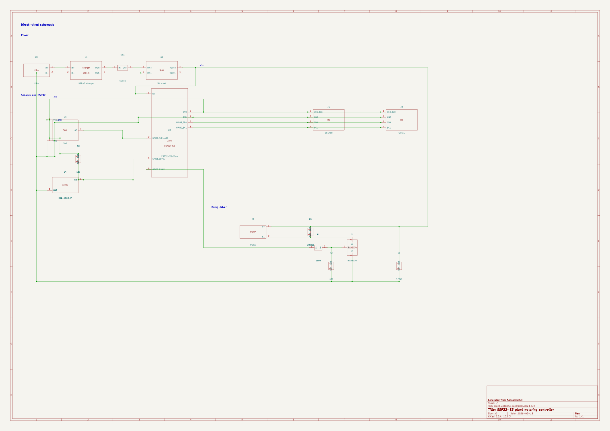

# Modular Irrigation Node

Hardware draft for an ESP32-S3 plant-watering node with LiPo power, environmental sensors, tank-level sensing, and a MOSFET-switched pump.

## Current state

- Module-level schematic in KiCad 10
- Saved electrical rules report dated 19 June 2026: 0 errors and 0 warnings, with four check types disabled
- No bench-test results are included
- Firmware, PCB layout, and enclosure are not included

## Hardware

- ESP32-S3 Zero
- 3.7 V LiPo battery with USB-C charging
- 5 V boost converter
- Capacitive soil-moisture sensor
- BH1750 light sensor
- SHT31 temperature and humidity sensor
- Float switch for the water tank
- MOSFET pump driver with flyback protection

## Files

- [KiCad project](hardware/plant_watering_controller.kicad_pro) and [schematic](hardware/plant_watering_controller.kicad_sch)
- [Schematic PDF](hardware/plant_watering_controller.pdf)
- [Electrical rules report](hardware/plant_watering_controller_erc.rpt)
- [Hardware notes](hardware/README.md)

Open the project in KiCad 10. Keep the files in `hardware/` together so the project can find its custom symbol library. The schematic documents connections between modules for prototyping.
